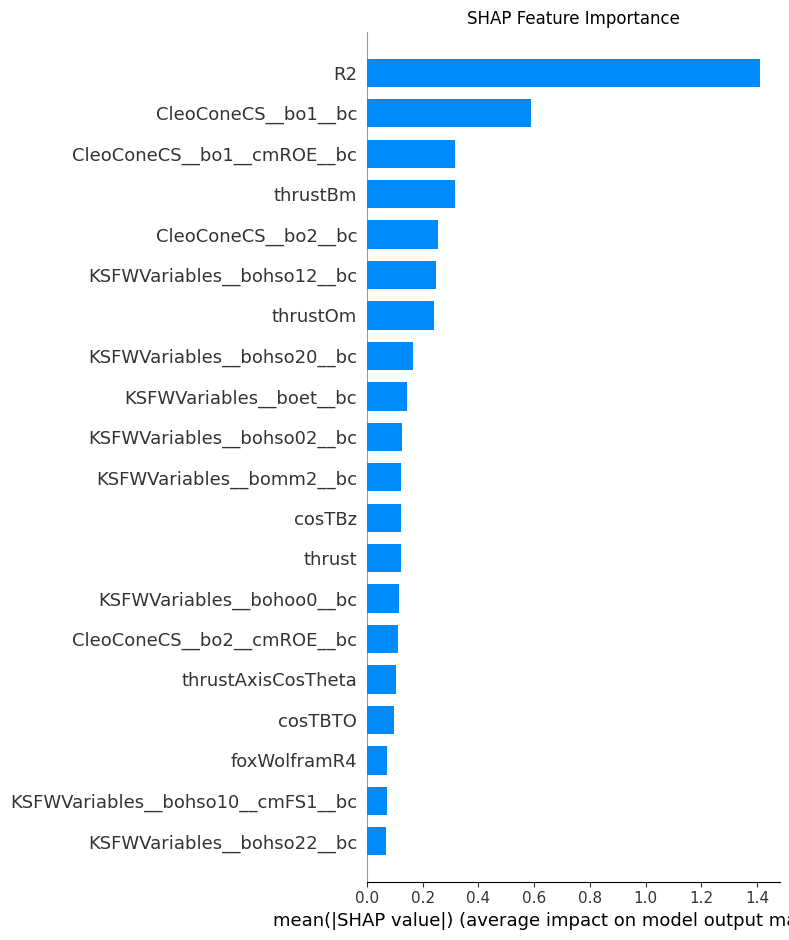
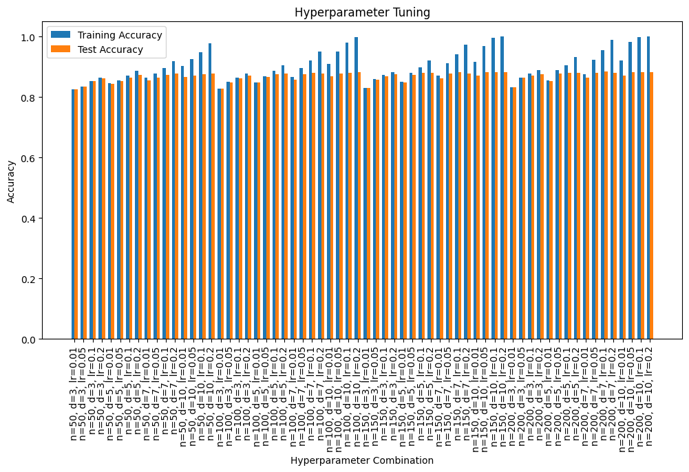
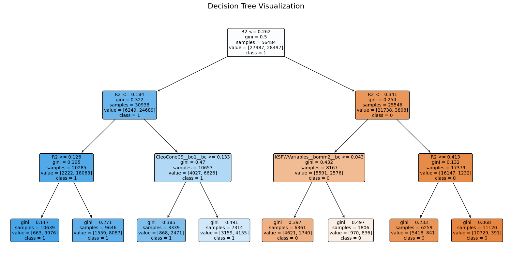
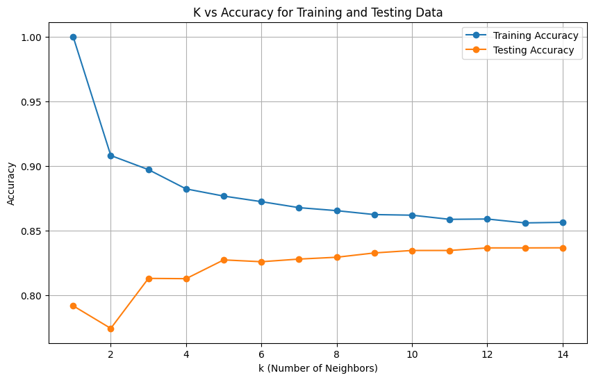
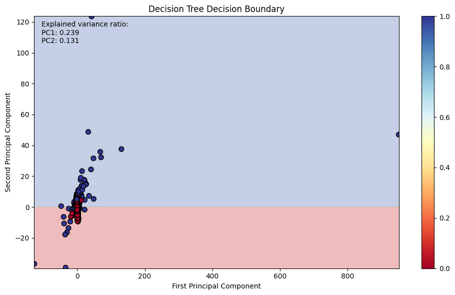
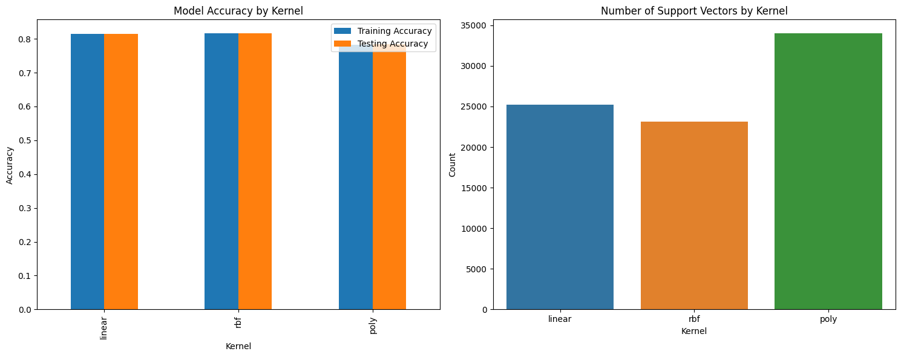
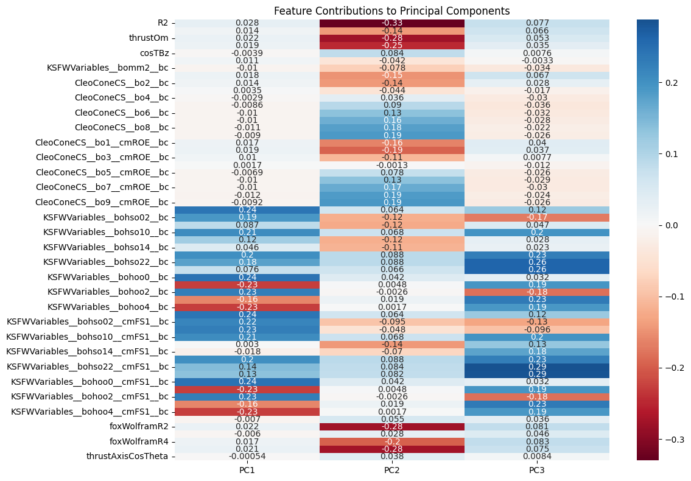

# Introduction
The goal of this project is to develop and evaluate a range of machine learning and deep learning models to classify events as either "Signal" or "Noise." This binary classification problem is crucial in domains such as high-energy physics, finance, and anomaly detection, where identifying meaningful events amidst large volumes of background data is essential.

# Dataset
We used a private dataset from the Belle 2 detector. It had 59 features and 70,000 examples.

---

## ALGORITHMS USED & RESULTS

Below are the algorithms we implemented and the corresponding results.

### 1. Logistic Regression from scratch
A foundational binary classifier implemented from the ground up to understand the core mechanics of logistic regression.

### 2. Deep Neural Networks (DNN)
We explored three different DNN architectures, ranging from simple to more complex, to capture non-linear relationships in the data.

### 3. XGBoost
An optimized distributed gradient boosting library. We used it for its high performance and interpretability.

**SHAP Feature Importance**
We used SHAP (SHapley Additive exPlanations) to understand which features were most influential in the XGBoost model's predictions. Features like `R2`, `cosTBTO`, and `KSFWV` were found to be highly important.

**Hyperparameter Tuning**
The model's performance was optimized by tuning its hyperparameters. The plot below shows the convergence during the tuning process.

**Decision Tree Visualization**
To better understand the model's decision-making process, we visualized one of the decision trees from the XGBoost ensemble.

### 4. K-Nearest Neighbours with PCA
We used PCA to reduce the dimensionality of the data before applying the KNN algorithm. The optimal number of neighbors (K) was determined by plotting accuracy against different K values.

### 5. Voting Classifier
An ensemble model that combines predictions from Logistic Regression, a Decision Tree, and a Support Vector Classifier (SVC) to improve overall accuracy.

### 6. Random Forest
An ensemble learning method that constructs a multitude of decision trees at training time and outputs the class that is the mode of the classes of the individual trees.

### 7. Decision Tree with PCA
To visualize the decision boundary, we reduced the feature space to three dimensions using PCA and then trained a Decision Tree classifier.

### 8. SVC with PCA
Similar to the above, a Support Vector Classifier was trained on the PCA-reduced data.

.png)

### 9. ElasticNet Regularized Logistic Regression
This model combines both L1 and L2 regularization with Logistic Regression to prevent overfitting and perform feature selection.

### 10. Linear Discriminant Analysis (LDA)
A dimensionality reduction technique that is also used for classification by finding a linear combination of features that separates two or more classes.

---

## Overall Model Performance

### Dimensionality Reduction Analysis
Principal Component Analysis (PCA) was used to reduce the number of features. The plot below shows the cumulative explained variance as a function of the number of principal components.

## Regards ~ Ketan, Shivam and Srujith
